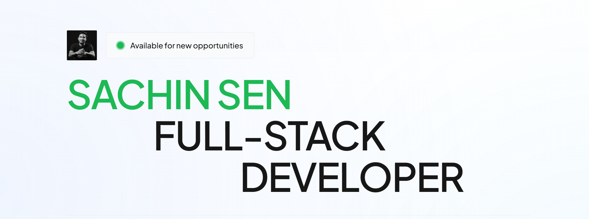

 

<table width="100%">
<tr>
<td width="33%" align="center"></td>
<td width="33%" align="center"></td>
<td width="33%" align="center"></td>
</tr>
</table>

---

---

<table width="100%">
<tr>
<td width="50%"></td>
<td width="50%"></td>
</tr>
</table>

